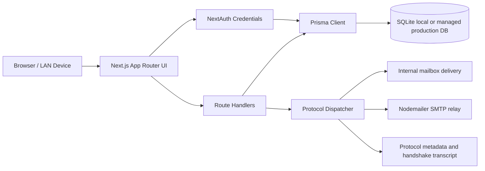
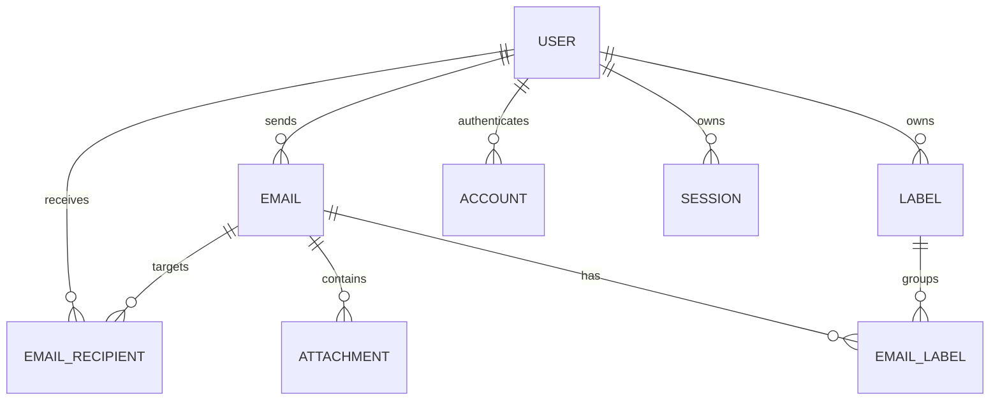

# Garuda Mail System Architecture

## 1. Scope

This document describes the current web application in `frontend/` at revision `2ed6b22`. The repository also contains a separate Python forensic framework and a legacy/root Vite surface; this architecture covers the actively updated Next.js product unless a future integration explicitly connects those systems.

## 2. High-Level Flow

## 3. Runtime Components

### Frontend

- Next.js 16 App Router
- React 19
- TypeScript
- Tailwind CSS and application CSS
- Framer Motion for transitions
- Lucide React for icons
- Recharts for analytical views

### Authentication

`src/lib/auth.ts` configures NextAuth with a credentials provider, Prisma adapter, JWT sessions, and role metadata. Server route handlers use `getServerSession(authOptions)` as the authorization boundary.

### Persistence

`src/lib/db.ts` owns the singleton Prisma client. `prisma/schema.prisma` defines users, NextAuth accounts and sessions, emails, recipients, attachments, labels, and email labels. The local development database is SQLite; the schema is designed to support a managed relational deployment with environment-specific configuration.

### API Layer

Current route families include:

- `/api/auth/[...nextauth]`: NextAuth session and sign-in endpoints.
- `/api/emails`: list, create, and mailbox operations.
- `/api/emails/[id]`: message detail and message state operations.
- `/api/register`: account registration.
- `/api/protocols`: authenticated protocol catalog/configuration surface.
- `/api/users`: authenticated user lookup for recipient selection.

### Protocol and delivery layer

`src/lib/protocols.ts` is the protocol catalog and transcript generator. `src/lib/mailer.ts` creates a dynamic Nodemailer transport when SMTP configuration exists, attempts external delivery, and returns delivery metadata. Internal recipient records are created through the email API and are independent of external SMTP availability.

## 4. Request Lifecycle

### Read mailbox

1. Browser sends a request with the NextAuth session cookie.
2. Route handler resolves the current user.
3. Unassigned recipient rows addressed to the current email can be claimed.
4. Prisma queries recipient-scoped folders and includes message metadata.
5. The route returns messages and unread counts as JSON.

### Send message

1. Compose UI submits validated message data.
2. API validates the payload with Zod.
3. Sender is loaded from the session user.
4. To and Cc addresses are normalized and matched to internal users where possible.
5. The dispatcher generates protocol evidence and optionally sends through Nodemailer.
6. The message and recipient rows are persisted.
7. The response reports the message id, protocol, TLS/cipher metadata, and delivery status.

## 5. Data Model

Important invariants:

- `Email.fromId` identifies the sender.
- `EmailRecipient.userId` identifies an internal recipient when resolved.
- `EmailRecipient.address` remains the canonical address for external or not-yet-claimed recipients.
- Folder and read/star state are recipient-scoped for received messages.
- Security fields belong to the message delivery record.

## 6. Deployment Topology

### Local development

- Next.js listens on `0.0.0.0:3000`.
- SQLite file is `frontend/prisma/dev.db` when `DATABASE_URL=file:./dev.db` is used.
- LAN access requires the host firewall and network profile to allow TCP 3000.

### Production

- Deploy the Next.js application behind HTTPS.
- Use a managed relational database and connection pooling.
- Store `NEXTAUTH_SECRET`, database credentials, and SMTP credentials in a secret manager.
- Do not rely on a local SQLite file for multi-instance deployments.
- Configure a single canonical `NEXTAUTH_URL` and rotate secrets through a controlled release.

## 7. Trust Boundaries

- Browser to server: HTTPS and secure session cookies.
- Route handler to database: server-only Prisma connection.
- Route handler to SMTP: server-only credentials and TLS policy.
- LAN peer access: not trusted merely because it is on the local network; authentication and encryption remain required.

## 8. Current Risks and Gaps

- `rejectUnauthorized: false` in the SMTP transport weakens certificate validation and must be replaced or made explicitly opt-in for controlled enterprise certificates.
- The generated transcript is evidence of application behavior, not packet-capture proof.
- NextAuth 4 peer dependency declarations do not yet formally cover Next 16; this combination must be validated in CI.
- The local database and seeded credentials are development-only assets.
